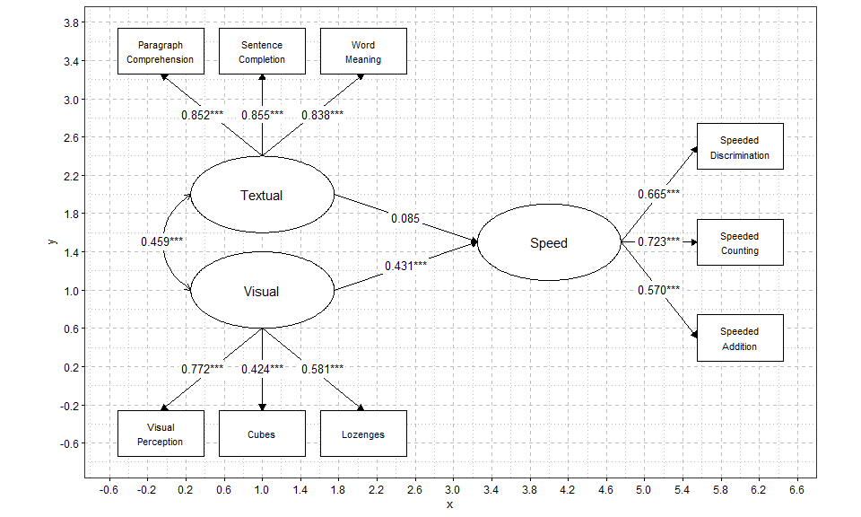

<!-- README.md is generated from README.Rmd. Please edit that file -->

# diy.sem.plot

<!-- badges: start -->

<!-- badges: end -->

`diy.sem.plot` allows users to manually plot fully customisable path
diagrams for structural equation models (SEM) in R. It avoids the
inflexibility of automated SEM plotting tools and the tedium of drawing
diagrams in external applications.

Users manually specify node positions using x-y coordinates, and where
on the perimeter of each node (top, bottom, left, or right) a paths
should begin and end. From there, the primary function `diyPaths()`
renders the diagram, automatically inserting estimates centered on the
midpoint of paths and adjusting each node’s shape to match its variable
type. A range of fine-tuning options are included, facilitating the
creation of a path diagram exactly as envisioned, entirely within R.

## Installation

Run the following to install the released version of `diy.sem.plot` from
CRAN.

``` r
install.packages("diy.sem.plot")
```

Run the following to install the development version of the package.

``` r
install.packages("pak")
pak::pkg_install("snagy86/diy.sem.plot")
```

## Example

Below is a brief example of using the package. For more examples, plus a
full explanation of the workflow and available arguments, see the
package’s vignette.

``` r


# full SEM example, this model may not make theoretical sense.
library(diy.sem.plot)
library(lavaan)
#> This is lavaan 0.7-2
#> lavaan is FREE software! Please report any bugs.
library(ggplot2)

data(HolzingerSwineford1939, package = "lavaan")

# specify the model

sem_model <- '
   visual =~ x1 + x2 + x3
   textual =~ x4 + x5 + x6
   speed =~ x7 + x8 + x9

   speed ~ visual + textual
   visual ~~ textual
'

# fit the model

fit_sem <- sem(sem_model, data = HolzingerSwineford1939)

# specify the node position, this was done iteratively with show_grid to help with layout.
node_list <- list(
  # main latent variable structure
  node("visual", x = 1, y = 1, label = "Visual"),
  node("textual", x = 1, y = 3, label = "Textual"),
  node("speed", x = 4, y = 2, label = "Speed"),

  # observed variables that visual perception ability loads onto
  node("x1", x = 0, y = -0.5, label = "Visual\nPerception"),
  node("x2", x = 1, y = -0.5, label = "Cubes"),
  node("x3", x = 2, y = -0.5, label = "Lozenges"),

  # observed variables that textual ability loads onto
  node("x4", x = 0, y = 4.5, label = "Paragraph\nComprehension"),
  node("x5", x = 1, y = 4.5, label = "Sentence\nCompletion"),
  node("x6", x = 2, y = 4.5, label = "Word\nMeaning"),

  # observed variables that speeded cognitive processing loads onto
  node("x7", x = 6, y = 1.25, label = "Speeded\nAddition"),
  node("x8", x = 6, y = 2, label = "Speeded\nCounting"),
  node("x9", x = 6, y = 2.75, label = "Speeded\nDiscrimination")
)

# Specify the paths

path_list <- list(
  # Structural paths
  path(from = "visual",  to = "speed",   side_from = "right", side_to = "left"),
  path(from = "textual", to = "speed",   side_from = "right", side_to = "left"),
  path(from = "visual",  to = "textual", side_from = "left",  side_to = "left", cov_curve = -0.6),

  # Visual factor loadings
  path(from = "visual", to = "x1", side_from = "bottom", side_to = "top", nudge_text_x = -0.1), # left
  path(from = "visual", to = "x2", side_from = "bottom", side_to = "top"),
  path(from = "visual", to = "x3", side_from = "bottom", side_to = "top", nudge_text_x =  0.1), # right

  # Textual factor loadings
  path(from = "textual", to = "x4", side_from = "top", side_to = "bottom", nudge_text_x = -0.1), # left
  path(from = "textual", to = "x5", side_from = "top", side_to = "bottom"),
  path(from = "textual", to = "x6", side_from = "top", side_to = "bottom", nudge_text_x =  0.1), # right

  # Speed factor loadings
  path(from = "speed", to = "x7", side_from = "right", side_to = "left", nudge_text_y = -0.1), # down
  path(from = "speed", to = "x8", side_from = "right", side_to = "left"),
  path(from = "speed", to = "x9", side_from = "right", side_to = "left", nudge_text_y =  0.1), # up

  # Latent variances / residuals
  path(from = "visual",  to = "visual",  variance_position = "top"),
  path(from = "textual", to = "textual", variance_position = "bottom"),
  path(from = "speed",   to = "speed",   variance_position = "top"),

  # Measurement variances (visual indicators)
  path(from = "x1", to = "x1", variance_position = "bottom"),
  path(from = "x2", to = "x2", variance_position = "bottom"),
  path(from = "x3", to = "x3", variance_position = "bottom"),
  
  # Measurement variances (textual indicators)
  path(from = "x4", to = "x4", variance_position = "top"),
  path(from = "x5", to = "x5", variance_position = "top"),
  path(from = "x6", to = "x6", variance_position = "top"),

  # Measurement variances (speed indicators)
  path(from = "x7", to = "x7", variance_position = "right"),
  path(from = "x8", to = "x8", variance_position = "right"),
  path(from = "x9", to = "x9", variance_position = "right")

)

# creating the diagram

p <- diyPaths(
  fit = fit_sem,
  node_positions = node_list,
  path_positions = path_list,
  standardised = TRUE,
  sig_linetype = TRUE,
  observed_node_size_adjust = 0.5, 
  observed_node_text_size = 4.5,
  latent_node_text_size = 6,
  path_text_size = 4.5,
  est_stars = TRUE,
  est_ci = TRUE,
  show_variances = TRUE,
  show_grid = TRUE,
  look_up_table = TRUE,
  margin_x = 0.3,
  margin_y = 0.3
)

print(p)
#> $plot
```



    #> 
    #> $look_up_table
    #>       type width height text_size
    #> 1   latent  1.50    1.0       6.0
    #> 2 observed  0.75    0.5       4.5
    #> 3     path    NA     NA       4.5
