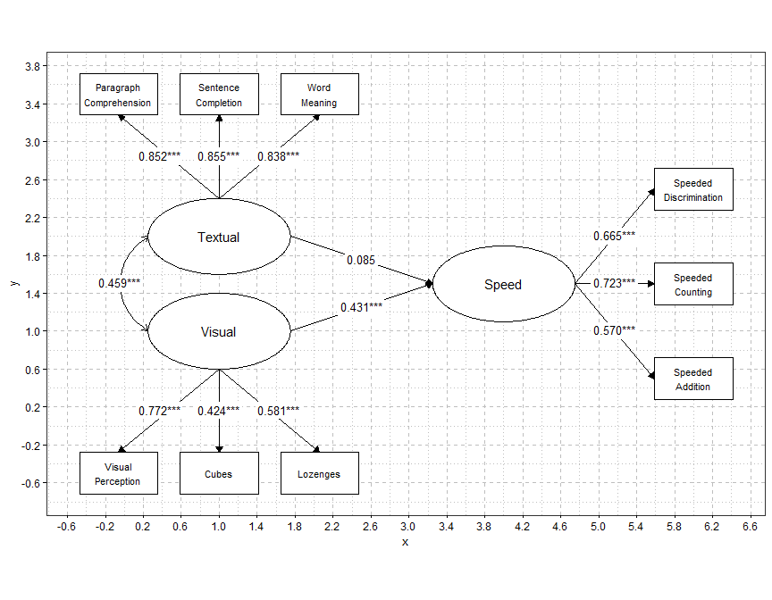

<!-- README.md is generated from README.Rmd. Please edit that file -->

# diy.sem.plot

<!-- badges: start -->

<!-- badges: end -->

diy.sem.plot allows you to manually plot fully customizable path
diagrams for structural equation models (SEM) using the diy_paths()
function. It avoids the inflexibility of automated SEM plotting tools
and the tedium of drawing diagrams in external applications.

You map out where nodes go using simple coordinates and specify the
attachment points (sides of the relevant nodes) where each path begins
and ends. A range of fine-tuning options are included, facilitating the
creation of a path diagram exactly as you envision it, entirely within
R.

Currently diy.sem.plot only works for lavaan fitted models.

## Installation

Run the following to install the development version of the package.

``` r
remotes::install_github("snagy86/diy.sem.plot")
#> Using GitHub PAT from the git credential store.
#> Downloading GitHub repo snagy86/diy.sem.plot@HEAD
#> rlang       (1.1.7 -> 1.3.0) [CRAN]
#> glue        (1.8.0 -> 1.8.1) [CRAN]
#> vctrs       (0.7.1 -> 0.7.3) [CRAN]
#> magrittr    (2.0.4 -> 2.0.5) [CRAN]
#> S7          (0.2.1 -> 0.2.2) [CRAN]
#> stringi     (1.8.7 -> 1.8.9) [CRAN]
#> xfun        (0.56  -> 0.60 ) [CRAN]
#> xml2        (1.5.2 -> 1.6.0) [CRAN]
#> png         (0.1-8 -> 0.1-9) [CRAN]
#> Rcpp        (1.1.1 -> 1.1.2) [CRAN]
#> curl        (7.0.0 -> 8.0.0) [CRAN]
#> systemfonts (1.3.1 -> 1.3.2) [CRAN]
#> ggplot2     (4.0.2 -> 4.0.3) [CRAN]
#> Installing 13 packages: rlang, glue, vctrs, magrittr, S7, stringi, xfun, xml2, png, Rcpp, curl, systemfonts, ggplot2
#> Installing packages into 'C:/Users/snagy/AppData/Local/Temp/RtmpSIaooi/temp_libpathad83d911622'
#> (as 'lib' is unspecified)
#> package 'rlang' successfully unpacked and MD5 sums checked
#> package 'glue' successfully unpacked and MD5 sums checked
#> package 'vctrs' successfully unpacked and MD5 sums checked
#> package 'magrittr' successfully unpacked and MD5 sums checked
#> package 'S7' successfully unpacked and MD5 sums checked
#> package 'stringi' successfully unpacked and MD5 sums checked
#> package 'xfun' successfully unpacked and MD5 sums checked
#> package 'xml2' successfully unpacked and MD5 sums checked
#> package 'png' successfully unpacked and MD5 sums checked
#> package 'Rcpp' successfully unpacked and MD5 sums checked
#> package 'curl' successfully unpacked and MD5 sums checked
#> package 'systemfonts' successfully unpacked and MD5 sums checked
#> package 'ggplot2' successfully unpacked and MD5 sums checked
#> 
#> The downloaded binary packages are in
#>  C:\Users\snagy\AppData\Local\Temp\RtmpawQuCs\downloaded_packages
#> ── R CMD build ─────────────────────────────────────────────────────────────────
#>       ✔  checking for file 'C:\Users\snagy\AppData\Local\Temp\RtmpawQuCs\remotes1c1c7a02d59\snagy86-diy.sem.plot-33d36f3/DESCRIPTION'
#>       ─  preparing 'diy.sem.plot':
#>    checking DESCRIPTION meta-information ...     checking DESCRIPTION meta-information ...   ✔  checking DESCRIPTION meta-information
#>       ─  checking for LF line-endings in source and make files and shell scripts
#>   ─  checking for empty or unneeded directories
#>       ─  building 'diy.sem.plot_0.1.0.tar.gz'
#>      
#> 
#> Installing package into 'C:/Users/snagy/AppData/Local/Temp/RtmpSIaooi/temp_libpathad83d911622'
#> (as 'lib' is unspecified)
```

## Example

Below is a brief example of what the function is capable of. More
examples can be found in the vignette for the package.

``` r
library(diy.sem.plot)

# full SEM example, this model may not make theoretical sense.

library(lavaan)
#> Warning: package 'lavaan' was built under R version 4.5.3
#> This is lavaan 0.7-2
#> lavaan is FREE software! Please report any bugs.
library(ggplot2)
#> Warning: package 'ggplot2' was built under R version 4.5.3

data(HolzingerSwineford1939, package = "lavaan")

# specify the model

sem_model <- '
   visual  =~ x1 + x2 + x3
   textual =~ x4 + x5 + x6
   speed   =~ x7 + x8 + x9

   speed ~ visual + textual
   visual ~~ textual
'

# fit the model

fit <- sem(sem_model, data = HolzingerSwineford1939)

# specify the node position, this was done iteratively with show_grid to help with layout.

node_positions <- list(
   # main latent variable structure
   node("visual", x = 1, y = 1, label = "Visual"),
   node("textual", x = 1, y = 2, label = "Textual"),
   node("speed", x = 4, y = 1.5, label = "Speed"),

   # observed variables that visual perception ability loads onto
   node("x1", x = -0.06, y = -0.5, label = "Visual\nPerception"), # \n creates a line break
   node("x2", x = 1, y = -0.5, label = "Cubes"),
   node("x3", x = 2.06, y = -0.5, label = "Lozenges"),

   # observed variables that textual ability loads onto
   node("x4", x = -0.06, y = 3.5, label = "Paragraph\nComprehension"),
   node("x5", x = 1, y = 3.5, label = "Sentence\nCompletion"),
   node("x6", x = 2.06, y = 3.5, label = "Word\nMeaning"),

   # observed variables that speeded cognitive processing loads onto
   node("x7", x = 6, y = 0.5, label = "Speeded\nAddition"),
   node("x8", x = 6, y = 1.5, label = "Speeded\nCounting"),
   node("x9", x = 6, y = 2.5, label = "Speeded\nDiscrimination")
)

# Specify the paths

path_positions <- list(
   path(from = "visual", to = "x1", side_from = "bottom", side_to = "top", nudge_text_x = -0.1), # nudging to stop white space overlap
   path(from = "visual", to = "x2", side_from = "bottom", side_to = "top"),
   path(from = "visual", to = "x3", side_from = "bottom", side_to = "top", nudge_text_x = 0.1),

   path(from = "textual", to = "x4", side_from = "top", side_to = "bottom", nudge_text_x = -0.1),
   path(from = "textual", to = "x5", side_from = "top", side_to = "bottom"),
   path(from = "textual", to = "x6", side_from = "top", side_to = "bottom", nudge_text_x = 0.1),

   path(from = "speed",   to = "x7", side_from = "right", side_to = "left"),
   path(from = "speed",   to = "x8", side_from = "right", side_to = "left"),
   path(from = "speed",   to = "x9", side_from = "right", side_to = "left"),

   path(from = "visual",  to = "speed", side_from = "right", side_to = "left"),
   path(from = "textual", to = "speed", side_from = "right", side_to = "left"),

   path(from = "visual",  to = "textual", side_from = "left", side_to = "left", cov_curve = -0.6)
)

# creating the diagram

p <- diyPaths(
   fit = fit,
   node_positions = node_positions,
   path_positions = path_positions,
   standardised = TRUE,
   est_stars = TRUE,
   observed_variable_size_adjust = 0.55, # making observed variables smaller than latent
   observed_node_text_size = 3,
   show_grid = TRUE,
   grid_axis_scale = 0.4
)

print(p)
```


